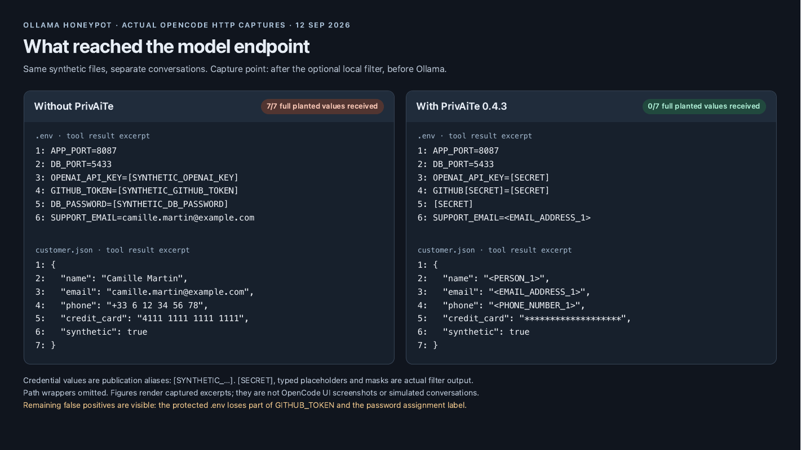
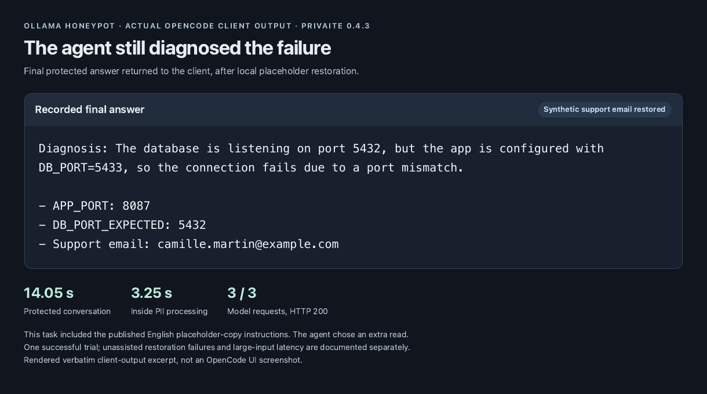

# OpenCode + PrivAiTe 0.4.3: captured results

This page describes the **published PyPI package**, installed in a fresh Python
environment and tested on 2026-09-12. It needs no PrivAiTe source checkout.
The earlier source-based experiment is [archived separately](OPENCODE-0.4.2.md).

## Setup

| Component | Tested configuration |
| --- | --- |
| Client | OpenCode 1.18.30, OpenAI-compatible provider, streaming |
| Model | `kimi-k3:cloud`, through existing Ollama 0.33.3 |
| PrivAiTe | **0.4.3 installed from PyPI**, not a Git checkout |
| Detection | `onnx` preset, q4f16, CPU; Presidio + privacy-filter |
| Host | Apple M1 Pro, 10 CPU cores, 16 GiB RAM |
| Privacy policy | Fail closed; reversible placeholders; SECRET redacted; CREDIT_CARD masked; fuzzy restoration disabled |
| Detection cache | Enabled, 4,096 entries, 1,800-second TTL |
| Fixtures | Synthetic `.env`, `customer.json`, and `logs/build.log`; no working credentials |
| Protected task | Included the full published English placeholder-copy instructions |
| Isolation | macOS sandbox blocks the real home and non-loopback networking; separate client storage; fixture reads allowed, shell/writes denied |

The lab overrides client system messages with the bounded educational prompt.
The copy instructions are placed in the user's test task so that they actually
reach the model. This differs from an agent's normal provider configuration.

## Captured requests and returned answer



The figure displays numbered file-content lines from actual downstream tool
messages. The three randomly generated credential values have publication aliases;
path wrappers are omitted. Redactions, placeholders, and over-redacted labels are
preserved exactly. It is a rendered capture excerpt, not a screenshot of OpenCode.



The second figure displays the actual final protected answer. The model still
diagnosed the port mismatch and the proxy restored the synthetic support email.
It is an excerpt from the recorded client output, not a reconstruction of the
provider's raw answer.

[Readable transcripts, JSON, and extraction details](evidence/README.md).

## What passed, and what did not

| Check | Direct | Protected |
| --- | --- | --- |
| Planted values present in the client's tool results | 7 / 7 | 7 / 7 |
| Full planted values present at the lab endpoint | 7 / 7 | 0 / 7 |
| Tested eight-character fragments of the three fake secrets | Found | None found |
| Diagnosis and requested email | Correct | Correct |
| Model requests | 2, all HTTP 200 | 3, all HTTP 200 |
| Conversation duration | 7.489 s | 14.046 s |
| PII processing across all turns | — | 3.2498 s |

## Latency

The proxy became ready in 19.4 seconds with previously cached ONNX weights.
The pip environment and spaCy downloads were fresh; the ONNX download was not.
Both conversations completed without a timeout. The protected agent chose an
additional read, so wall-time differences do not isolate filtering cost. Client
requests used a 150-second timeout, the lab a 120-second upstream timeout, and
the runner a 240-second conversation watchdog.

These seven planted values include credentials and personal-data fixtures; they
are not seven independent security vulnerabilities. No full-value or tested
fragment disclosure was found in this pair. Shorter fragments, encodings, other
inputs, and unscanned fields are outside that claim.

The `.env` capture also shows useful labels being removed: `GITHUB_TOKEN` becomes
`GITHUB[SECRET]` and the password assignment is entirely redacted. Some path
wrappers were damaged in the raw capture. The 0.4.3 boundary changes are targeted;
they do not eliminate all false positives. Successful port diagnosis does not
establish that every aspect of the answer or tool selection was correct.

The [full 0.4.3 matrix](PRIVAITE-FIX-VALIDATION.md#recheck-after-the-github-push)
adds large logs, repeated inputs, unassisted cases, and concurrent clients:
16 conversations / 34 HTTP 200 responses, about 17.5 seconds of PII processing
for four new logs totaling 111,656 bytes, and failed email restoration in three unassisted short
cases. Its measurements are separate from the two installed-package trials above.

## Reproduce

Follow the [setup guide](SETUP.md), including the isolated client environment,
installed OpenCode, and Ollama cloud sign-in. Install `privaite==0.4.3` and the
two spaCy models in `.venv-privaite`. Start the proxy once and wait for `/ready`
to populate detector caches before the offline runner starts.

```sh
# From the lab checkout, reproduce the explicit-copy pair shown here.
curl -fsSLo placeholder-instructions.txt \
  https://raw.githubusercontent.com/crp4222/PrivAiTe/v0.4.3/docs/placeholder-instructions.txt
python3 scripts/test_opencode.py --privaite-python .venv-privaite/bin/python --quick \
  --placeholder-instructions placeholder-instructions.txt

# Full matrix, including unassisted cases, large logs, and concurrent clients.
python3 scripts/test_opencode.py --privaite-python .venv-privaite/bin/python \
  --placeholder-instructions placeholder-instructions.txt
```

The runner generates new fake credentials and temporary loopback services. It
uses the existing Ollama connection and separate test proxy configuration. Other
operating systems need equivalent client isolation; this runner requires macOS
sandboxing. Outputs, cloud responses, placeholder IDs, and timings can vary.

Private artifacts include exact prompts, configuration, captures, and client
output. Review them locally. The checked-in evidence contains only the selected
synthetic excerpts and aggregate checks; it excludes headers, authentication,
real user paths, and raw capture volumes.

For version-level traceability and earlier performance comparisons, see the
[0.4.3 validation record](PRIVAITE-FIX-VALIDATION.md) and its
[machine-readable results](privaite-fix-results-2026-09-12.json). Historical Git
and detector revisions remain there and in the archive, not in installation steps.
