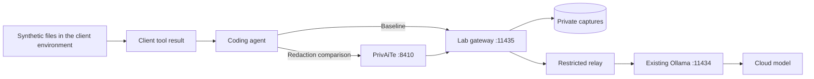

# Setup and operation

[Back to the overview](../README.md) · [Current OpenCode results](OPENCODE-EXPERIMENT.md)

The gateway forces one model and replaces client `system` / `developer` messages
with [`config/system.txt`](../config/system.txt). The default prompt targets only
the synthetic files requested in an isolated workspace. Client permissions and
OS isolation enforce access; the prompt itself does not.

A restriction removed by the gateway was never shown to the model. Record where
an instruction was supplied and inspect the effective upstream request before
claiming the model ignored it. This experiment changes the agent's usual system
instructions and does not characterize its default setup.

## Where the observation happens



In `local` mode, the capture point is between the client or PrivAiTe and your
existing Ollama installation. Ollama handles cloud authentication and can adapt
the protocol afterward. These are not decrypted captures of the cloud TLS session.

The viewer groups questions, answers, API-returned reasoning, tool calls, and tool
results into readable blocks. It does not expose hidden reasoning that the API
never returns. Raw JSONL captures remain available for exact inspection.

## Try the capture pipeline without a model account

Prerequisites: Python 3.11+ and Docker Desktop or OrbStack. Image builds and initial
dependency installation require network access. Run from a fresh lab checkout:

```sh
cd ollama-honeypot
python3 scripts/compose_local.py --bind 127.0.0.1 --mode demo
```

In another terminal, from the repository root:

```sh
python3 scripts/watch.py --docker --follow
```

Send a synthetic request:

```sh
curl -sS http://127.0.0.1:11435/api/chat \
  -H 'Content-Type: application/json' \
  -d '{"model":"kimi-k3:cloud","messages":[{"role":"user","content":"Hello from the synthetic lab."}],"stream":true}'
```

`demo` mode returns explicitly labelled simulated responses. It exercises the
capture pipeline; it does **not** demonstrate a model choosing tools or leaking data.

## Run the controlled agent experiment

Use a disposable VM or equivalent isolated client environment with no personal
home directory, real shell history, agent transcripts, or working credentials
mounted into it. Docker isolation of the **server** does not isolate a separately
running **client agent**.

1. Create synthetic `.env`, customer, and log files with known test values. Keep the expected
   values locally so full, partial, and missed redactions can be counted.
2. Review `config/system.txt` and target only those fixtures. Record its exact
   contents, the client permissions, client version, model, and configuration.
3. Ask the agent to diagnose a problem in the synthetic files. Observe tool
   execution in the client and the subsequent request at the capture point.
4. Repeat with PrivAiTe in the request path. Start a fresh conversation for each run.
5. Repeat with access to the target file denied by client permissions. Check whether
   the read was actually blocked, rather than relying on the assistant's description.

For real model calls, the current backend is **`kimi-k3:cloud` through an existing
Ollama installation**. “Local” describes the Ollama connection; inference still
uses the cloud account already signed into Ollama. On the server host:

```sh
ollama pull kimi-k3:cloud
# The checked-in system.txt already uses the bounded educational prompt.
python3 scripts/compose_local.py --bind 127.0.0.1 --mode local
```

This setup was exercised on macOS with OrbStack. For a separate client VM, choose
the server's specific private LAN address and use that address in the client URLs.
The loopback examples below assume the client and proxies can reach the same host.

After changing only the system prompt, run `docker compose restart gateway` and
start a new client conversation. Changing `.env` requires recreating the service
to load the new environment. See the [operating guide](USAGE.fr.md).

### Connect an OpenAI-compatible client

The baseline URL is `http://127.0.0.1:11435/v1`, with model `kimi-k3:cloud`.
For an OpenCode project configuration in the disposable workspace:

```json
{
  "$schema": "https://opencode.ai/config.json",
  "model": "observation-lab/kimi-k3:cloud",
  "small_model": "observation-lab/kimi-k3:cloud",
  "provider": {
    "observation-lab": {
      "npm": "@ai-sdk/openai-compatible",
      "options": {
        "baseURL": "http://127.0.0.1:11435/v1",
        "apiKey": "lab"
      },
      "models": {
        "kimi-k3:cloud": { "name": "Kimi K3 — observation lab" }
      }
    }
  }
}
```

`lab` is an SDK placeholder, not authentication enforced by the lab. Keep client
permission checks enabled. Other configured providers or auxiliary models can
bypass this endpoint; check the selected provider for every part of the session.

### Put PrivAiTe before the capture point

Install the tested [PrivAiTe 0.4.3 release](https://github.com/crp4222/PrivAiTe/releases/tag/v0.4.3)
from PyPI in a separate environment. Run these commands from the lab checkout:

```sh
python3 -m venv .venv-privaite
.venv-privaite/bin/python -m pip install --upgrade "privaite==0.4.3"
.venv-privaite/bin/python -m spacy download en_core_web_lg
.venv-privaite/bin/python -m spacy download fr_core_news_md
```

The first ONNX startup also downloads the pinned detector model. Allow for this
installation cost before measuring request latency. For the automated OpenCode
runner, use `--privaite-python .venv-privaite/bin/python`; a PrivAiTe Git checkout
is not required.

This example runs PrivAiTe as a native process on the lab host. Save the
following as a separate PrivAiTe configuration, for example `privaite-lab.yaml`:

```yaml
server:
  host: "127.0.0.1"
  port: 8410
auth:
  enabled: true
providers:
  - model_name: "kimi-k3:cloud"
    litellm_params:
      model: "openai/kimi-k3:cloud"
      api_base: "http://127.0.0.1:11435/v1"
      api_key: "lab"
pii:
  enabled: true
  preset: "onnx"
  on_error: "block"
  anonymization:
    method: "placeholder"
    entity_overrides:
      SECRET:
        method: "redact"
      CREDIT_CARD:
        method: "mask"
        masking_char: "*"
  deanonymization:
    enabled: true
    fuzzy_matching: false
  detection_cache:
    enabled: true
    max_entries: 4096
    ttl_seconds: 1800
  passthrough:
    system_messages: false
    tool_calls: false
```

From the lab checkout, with `privaite-lab.yaml` saved there:

```sh
PRIVAITE_API_KEYS=lab-local-only .venv-privaite/bin/python -m privaite --config privaite-lab.yaml
```

`lab-local-only` is a disposable example client key. In the OpenCode configuration,
change `baseURL` to `http://127.0.0.1:8410/v1` and `apiKey` to `lab-local-only`.
PrivAiTe's upstream URL stays pointed at the lab's **11435** port. A direct connection
to Ollama on 11434 would bypass this capture point.

PrivAiTe scans supported request fields, including message text and tool-call
arguments, before forwarding. It can restore reversible replacements in responses
returned to the client. With the configuration above, secrets are redacted and
cards masked irreversibly. Therefore, inspect the **capture after PrivAiTe** to
measure outbound disclosure; the client display alone cannot establish it.

This example opts into PrivAiTe's detection cache for repeated conversation text.
It keeps salted hashes and detection span metadata, not raw text or reversible
maps; see its [threat model](https://github.com/crp4222/PrivAiTe#threat-model).
New files still incur detection cost. Wait for PrivAiTe's `/ready` endpoint before
starting the client. The [measured experiment](OPENCODE-EXPERIMENT.md#latency)
separates initialization, cold filtering, and cache reuse.

This is detection-based filtering, not a guarantee that every secret is found.
Coverage differs by protocol and field. Tool definitions, object keys, and other
documented unscanned fields remain relevant to the experiment. See PrivAiTe's
[scanned surface](https://github.com/crp4222/PrivAiTe/blob/main/docs/api.md) and
[threat model](https://github.com/crp4222/PrivAiTe#threat-model).

## Read the evidence

```sh
# Human-readable stream; include resent history when examining prior tool calls.
python3 scripts/watch.py --docker --follow --history

# Inspect one captured exchange, including exact request bodies.
python3 scripts/watch.py --docker --id REQUEST_ID --json
```

| Capture event | What it establishes |
| --- | --- |
| `incoming` | What reached the lab, already filtered if PrivAiTe is upstream |
| `policy` | Which model was forced and which client instructions were removed |
| `upstream_request` | The JSON values submitted to the configured Ollama backend |
| `upstream_chunk` | The received response bytes, stored as base64 |
| `end` / `blocked` | Transport outcome or refusal; not proof that an agent task succeeded |

For a reproducible report, distinguish a value that was never read from a value
that was read and successfully filtered. Count full disclosures, partial
disclosures, complete redactions, and false positives. Record whether the agent
still completed its task and the added latency.

Replay the **same synthetic request payload** through the baseline and filtered
paths to compare redaction. Use repeated fresh agent sessions separately to study
behavior: autonomous runs need not choose the same tools or read the same files.
Do not publish real capture volumes or personal histories as examples.

## What has been checked, and what remains open

The [validation record](../VALIDATION.md) documents 37 passing tests, real Ollama chat
and Anthropic streaming calls, forced model/prompt handling, capture fidelity,
quotas, and server isolation checks. These are functional checks, not a benchmark
of protection against arbitrary agents or secrets.

The [OpenCode experiment](OPENCODE-EXPERIMENT.md) adds actual file reads and
an A/B comparison with PrivAiTe, including cold-cache latency, larger tool results,
concurrent clients, and a denied read. A macOS runner generates its own fixtures
and records both disclosure and task-completion checks.

The [PrivAiTe 0.4.3 follow-up](PRIVAITE-FIX-VALIDATION.md) completed all 16
OpenCode conversations without a timeout. Four-log PII processing fell from
31.91 to 17.46 seconds in the observed runs. It also checks preserved labels and
delimiters, and documents the remaining dependence on placeholder-copy instructions.

Exploratory operator observations motivated the PrivAiTe comparison: some credential
values were replaced with `[SECRET]`, while partial replacements and identifying
paths remained visible. Those observations are not a published, controlled leak-rate
measurement. No universal protection rate or new CVE is claimed here.

| Interface | Current scope |
| --- | --- |
| Ollama `/api/chat`, `/api/generate` | Implemented; a real `/api/chat` call was checked |
| OpenAI `/v1/chat/completions` | OpenCode 1.18.30 workflow checked with and without PrivAiTe |
| Anthropic `/v1/messages` | Real streaming call checked; a full Claude Code workflow needs separate validation |
| OpenAI `/v1/responses` | Not implemented; this lab does not establish native Codex CLI support |
| Model administration, embeddings, images, provider-hosted tools | Not exposed |

Do not infer support for every coding client from compatible endpoint names.
Record the exact client version and workflow that was actually tested.

## Boundaries and operation

- The server forces `kimi-k3:cloud` in `local` mode. Selecting another advertised
  name does not switch the backend. Direct `cloud` mode uses `kimi-k3` and a dedicated key.
- Server containers run without root, with read-only filesystems and dropped
  capabilities. The gateway has no direct Internet route; the relay reaches the
  configured backend. This does not constrain an agent running elsewhere.
- Client-to-lab traffic is HTTP, without lab authentication. Bind only to loopback
  or a controlled private LAN. The launcher rejects public and wildcard addresses;
  no router, UPnP, or WAN configuration is performed.
- Fresh-install defaults are 30 requests/day, 100 total, two concurrent calls,
  2,048 requested output tokens, and a 120-second request timeout. `0` disables each
  request-count quota. Local `.env` overrides can change these values.
- Captures are private local data: a Docker volume, or `captures/` in native mode.
  `.env`, `private/`, and `captures/` are Git-ignored. The operator system prompt is
  tracked and also copied into the Docker image; do not put secrets in it.

Detailed setup, direct-cloud mode, LAN access, restart procedures, and capture
formats are in the [French operating guide](USAGE.fr.md).

```sh
# Run the unit tests with a fake provider; no model call is made.
uv sync --frozen
uv run --frozen pytest -q

# Stop the server while keeping captures and quota counters.
docker compose down
```

This lab studies the boundary between tool permissions, data sent to a model,
and filtering on that path. Related background:
[OWASP Excessive Agency](https://genai.owasp.org/llmrisk/llm062025-excessive-agency/)
and [Sensitive Information Disclosure](https://genai.owasp.org/llmrisk/llm022025-sensitive-information-disclosure/).
