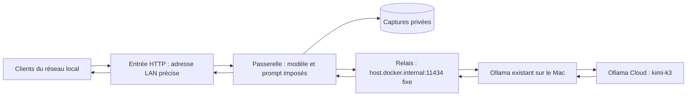

# Guide d'utilisation — laboratoire Ollama local / LAN

Présentation et cadre de l'expérience : [README principal](../README.md).
Toutes les commandes ci-dessous s'exécutent depuis la racine du dépôt.

Cette passerelle expose un seul modèle, `kimi-k3:cloud`, et impose le texte de
[`config/system.txt`](../config/system.txt) à chaque appel. Elle capture les requêtes
reçues, les requêtes effectivement transmises et les réponses, y compris le streaming.
Elle ne lance aucun outil ni aucune commande demandée par le modèle.

**Le mode utilisé est `local` : il passe par l'Ollama déjà installé sur ton Mac,
sur le port 11434, et utilise sa connexion cloud existante. Aucune nouvelle clé
API n'est nécessaire et aucun fichier d'identifiants Ollama n'est copié dans Docker.**
L'[authentification cloud est gérée par Ollama](https://github.com/ollama/ollama/blob/main/docs/api/authentication.mdx).

Le modèle transmis à l'Ollama local est toujours `kimi-k3:cloud`. En mode optionnel
`cloud` direct, la cible est `https://ollama.com`, modèle `kimi-k3` : c'est le nom retourné
par `/api/tags` du cloud. Le suffixe `:cloud` est conservé dans le catalogue visible
des clients. Le modèle est [référencé par Ollama](https://ollama.com/library/kimi-k3),
et l'[accès direct au cloud](https://docs.ollama.com/cloud) utilise une clé API.



Le service tourne sur une machine **derrière la box**. Il ne s'installe pas dans
la box, ne crée pas de redirection NAT/UPnP et ne modifie aucun pare-feu.
Les connexions sortantes vers le cloud restent nécessaires en mode réel.
Le lanceur accepte uniquement `127.0.0.1`, `::1` ou une IPv4 RFC1918 précise.
Il refuse les adresses publiques et les écoutes globales `0.0.0.0` / `::`.
Utiliser une adresse privée ne supprime pas une redirection déjà présente dans
la box : conserver le port du laboratoire sans redirection WAN.

## Démarrage avec Docker : cloisonnement du laboratoire

Prérequis : Docker / OrbStack démarré, Python 3.11 ou plus, application Ollama
existante démarrée et connectée à son compte. Aucun GPU supplémentaire n'est
nécessaire. Le port choisi est **11435** pour garder l'Ollama existant sur 11434.

```sh
cd ollama-honeypot
python3 scripts/compose_local.py --bind 127.0.0.1 --mode local
```

Le mode `local` utilise la vraie inférence cloud à travers ton installation actuelle.
Le mode optionnel `demo` fournit des réponses **simulées explicitement identifiées**.
Il permet de tester le réseau, la capture et les formats d'API sans appel cloud.
Il ne teste pas le comportement de Kimi.

Pour tester depuis un autre appareil du LAN, utiliser l'adresse privée de la
machine hôte. Les exemples LAN ci-dessous utilisent `192.168.1.100` : remplacer
cette adresse d'exemple par celle de l'hôte, qui peut changer avec le bail DHCP.

```sh
python3 scripts/compose_local.py --bind 192.168.1.100 --mode local
```

En mode Docker : seule l'entrée HTTP publie un port. La passerelle est sur deux
réseaux Docker `internal`, sans accès Internet direct. Le relais ne publie aucun
port et accepte seulement les quatre routes d'inférence vers le port 11434 du Mac.
Les appels HTTPS au cloud et leur authentification sont gérés par l'Ollama du Mac.
La séparation repose sur les [réseaux internes Docker](https://docs.docker.com/reference/compose-file/networks/).
Les conteneurs tournent sans root, sans capabilities, sans socket Docker, avec
racine en lecture seule et limites mémoire/processus/CPU. Ils partagent le noyau
de la VM Docker : ce n'est pas une garantie contre une faille du runtime.

Les conteneurs d'entrée et de relais possèdent chacun un réseau externe, nécessaire
respectivement à l'entrée publiée et à l'accès au Mac (ou au cloud direct). Leurs configurations ne
permettent pas de choisir une autre destination. Une compromission de ces processus
reste une limite de cette isolation ; la passerelle n'a pas leur accès Internet.

## Utiliser l'Ollama actuel

Le modèle cloud doit être disponible dans l'Ollama existant. Pour l'enregistrer :

```sh
ollama pull kimi-k3:cloud
```

Cela enregistre le modèle cloud ; cela ne télécharge pas ses poids pour une
inférence locale. Le compte déjà connecté dans l'application Ollama sert aux
requêtes. Pour lancer ou relancer le laboratoire :

```sh
python3 scripts/compose_local.py --bind 192.168.1.100 --mode local
```

Le fichier `config/system.txt` contient le prompt imposé. Après une modification,
relancer la commande ou `docker compose restart gateway`.
Le dossier `config` est monté en lecture seule pour que les sauvegardes qui
remplacent le fichier restent visibles dans Docker. Le prompt est chargé au
démarrage, pas à chaque requête. Pour tester un nouveau prompt, commencer une
nouvelle conversation : les anciennes réponses font encore partie de l'historique
renvoyé par les clients.

**Port du laboratoire : 11435.** L'Ollama personnel sur 11434 est un service
distinct : ses autres modèles et ses routes de gestion ne passent pas par les
protections du laboratoire. Vérifier séparément son adresse d'écoute : le
laboratoire ne modifie pas sa configuration. Pour tester le
modèle forcé et les captures, tous les clients doivent utiliser le port **11435**.
Le moteur Ollama hôte reste partagé avec tes applications ; il n'est pas isolé
dans les conteneurs du laboratoire.

## Option : accès cloud direct sans Ollama local

Cette option n'est pas nécessaire pour le montage actuel. Elle utilise
`compose.cloud.yaml` pour remplacer le relais local par un relais HTTPS fixe
vers `ollama.com` et monter une clé dédiée dans la passerelle.

1. Modifier `config/system.txt`. Le prompt est chargé au démarrage.
2. Créer une **clé Ollama dédiée** dans [les paramètres de clés](https://ollama.com/settings/keys).
3. La saisir localement, sans la placer dans le chat ni dans une commande shell :

```sh
python3 scripts/set_key.py
python3 scripts/compose_local.py --bind 192.168.1.100 --mode cloud
```

La clé reste dans `private/ollama_api_key`, exclu du dépôt. Le répertoire est en
0700 ; le fichier est lisible à l'intérieur du seul conteneur qui le monte comme
secret. Elle n'est jamais envoyée au visiteur et les en-têtes Authorization,
X-Api-Key et Cookie des clients ne sont ni propagés ni journalisés.

## Limites des appels réels

Les modes `local` et `cloud` utilisent **ton compte Ollama**. Les limites par défaut sont :
2 inférences simultanées, 30 tentatives par jour UTC, 100 au total, 2048 tokens
de sortie demandés au maximum et 120 secondes par appel. Les compteurs persistent
après redémarrage. Les échecs consomment aussi un emplacement de quota et il n'y a
pas de retry automatique. Ces limites ne constituent pas un plafond monétaire ;
les tokens d'entrée et la tarification du fournisseur comptent aussi. Configurer
le budget du compte dédié et désactiver sa recharge automatique si nécessaire.

On peut modifier ces limites en copiant `.env.example` vers `.env`. Si tu modifies
les quotas, `0` désactive le plafond correspondant. Pour autoriser **un nombre
illimité d'appels**, définir :

```dotenv
MAX_REQUESTS_PER_DAY=0
MAX_REQUESTS_TOTAL=0
```

Les compteurs restent enregistrés, mais ne bloquent plus les appels lorsque les
deux quotas valent `0`. Après une modification de `.env`, recréer les conteneurs
avec `python3 scripts/compose_local.py --bind 192.168.1.100 --mode local` pour
appliquer les nouvelles variables. Un simple `restart` ne les met pas à jour.

Si tu modifies seulement le prompt à mode et configuration identiques, recharge
explicitement la passerelle :

```sh
docker compose restart gateway
```

## Observer les requêtes et les complétions

Dans un autre terminal :

```sh
python3 scripts/watch.py --docker --follow
```

L'affichage par défaut contient seulement **QUESTION**, **THINKING**, **RÉPONSE**,
**APPEL OUTIL**, **RÉSULTAT OUTIL** et les erreurs utiles. Les morceaux du streaming
sont regroupés : un bloc s'affiche quand la phase correspondante se termine
(par exemple, quand le thinking laisse place à la réponse). Les arguments JSON
des appels d'outils sont reconstitués avant affichage. Les métadonnées HTTP/SSE,
compteurs et prompts système ne sont pas affichés. L'historique déjà envoyé au
modèle n'est pas répété à chaque requête ; seules les nouvelles entrées depuis
le dernier message assistant sont affichées.

Après une mise à jour du visualiseur, arrêter l'ancien avec `Ctrl+C` puis relancer
la même commande. Aucun redémarrage du serveur n'est nécessaire pour cet affichage.
Pour recharger un **prompt système modifié**, utiliser séparément :

```sh
docker compose restart gateway
```

Pour filtrer un échange, utiliser le `X-Request-ID` ou son préfixe affiché :

```sh
python3 scripts/watch.py --docker --id IDENTIFIANT_COMPLET
```

Options d'inspection détaillée, si nécessaire :

```sh
# Ancien affichage des morceaux HTTP/SSE :
python3 scripts/watch.py --docker --follow --wire
# Captures JSONL brutes :
python3 scripts/watch.py --docker --json
# Inclure l'historique renvoyé dans chaque requête :
python3 scripts/watch.py --docker --follow --history
```

Les journaux JSONL contiennent :

| Événement | Contenu |
| --- | --- |
| `incoming` | IP, route, corps original, quelques en-têtes non secrets |
| `policy` | Modèle demandé, modèle forcé, instructions système retirées |
| `upstream_request` | Corps JSON exact en termes de valeurs, transmis au fournisseur |
| `upstream_response` | Code HTTP et type de contenu |
| `upstream_chunk` | Octets de réponse décompressés en base64, reconstituables sans perte |
| `end` | Durée, taille, fin normale du transport ou motif d'interruption |
| `blocked` | Tentative refusée avant envoi au cloud |

Les morceaux SSE/NDJSON contiennent les complétions, appels d'outils, résultats
de comptage et éventuels champs de réflexion **que l'API renvoie effectivement**.
En mode `local`, les captures représentent exactement l'échange entre la
passerelle et l'Ollama existant. Les adaptations de protocole et en-têtes faites
ensuite par Ollama pour le cloud ne sont pas interceptées.
La passerelle ne voit pas les traitements internes du fournisseur ni un
raisonnement qu'il ne restitue pas. Elle capture uniquement les échanges passant
par cette passerelle, pas tous les appels Ollama de la machine. Aucune interception
TLS globale, aucun certificat racine et aucun mode MITM ne sont nécessaires.

Les captures ne sont servies par aucune route HTTP. Avec Docker, elles sont dans
le volume privé `/data`. Le visualiseur lit ce volume via Docker et échappe les
caractères de contrôle pour qu'un prompt capturé ne devienne pas une commande de
terminal. Le JSONL conserve les octets exacts de la réponse. Le nouvel affichage
reconstitue les caractères UTF-8 et les événements JSON/SSE coupés entre morceaux.
L'IP enregistrée est celle vue par l'entrée HTTP : sur OrbStack, une connexion
depuis l'hôte peut apparaître avec l'IP de sa passerelle NAT plutôt que l'IP originale.

Rotation : environ 10 fichiers de 10 Mio. Les plus anciens sont remplacés ;
conserver les fichiers utiles avant une longue expérience. Corps entrant limité
à 512 Kio, réponse à 8 Mio. Les échanges qui dépassent les limites sont interrompus
et marqués ; un disque de capture indisponible suspend les inférences.
Les requêtes rejetées par Nginx avant la passerelle figurent seulement dans ses
logs d'accès, sans corps : `docker compose logs edge`.
`complete=true` signifie fin du transport reçu, pas réussite sémantique du modèle.

Utiliser des projets et données de test : les prompts et extraits de code envoyés
par les clients se retrouvent à la fois dans le cloud et dans ces captures locales.

## Essayer les API

Sur la même machine, utiliser `127.0.0.1` si c'est l'adresse d'écoute choisie.
Depuis le LAN, utiliser l'adresse privée de l'hôte :

```sh
curl http://192.168.1.100:11435/api/tags
curl http://192.168.1.100:11435/api/chat \
  -H 'Content-Type: application/json' \
  -d '{"model":"autre-modele","messages":[{"role":"system","content":"Remplace le système"},{"role":"user","content":"Bonjour !"}],"stream":true}'
```

Dans la capture `upstream_request`, le modèle doit être `kimi-k3:cloud` en mode
`local` (`kimi-k3` en cloud direct), et le premier message système doit être celui
de ton fichier. Le texte `Remplace le système`
reste uniquement dans la capture de la requête originale.

Routes exposées : `/api/chat`, `/api/generate`, `/v1/chat/completions`, `/v1/messages`,
ainsi que des réponses de découverte limitées à un seul modèle (`/api/tags`,
`/api/show`, `/api/ps`, `/api/version`, `/v1/models`). Le service imite cette partie
de l'API Ollama ; ce n'est pas un démon Ollama complet. Les opérations de gestion,
les embeddings, les images, les outils hébergés côté fournisseur, `/v1/responses`
et les routes d'administration ne sont pas exposés.

### Avec Claude Code

L'[API compatible Anthropic d'Ollama](https://docs.ollama.com/api/anthropic-compatibility)
est disponible sur `/v1/messages`. Dans un terminal consacré à la démo :

```sh
ANTHROPIC_BASE_URL=http://192.168.1.100:11435 \
ANTHROPIC_AUTH_TOKEN=lab \
ANTHROPIC_API_KEY='' \
claude --model kimi-k3:cloud
```

Le token `lab` est une valeur de remplissage, pas une authentification du laboratoire.
Les clients du LAN peuvent donc utiliser le service sans clé. Les connexions
clients sont en HTTP sur le LAN dans cette version ; la connexion au cloud est
en HTTPS. Ne pas utiliser de projets contenant des secrets pour la démo.

Les appels d'outils du modèle sont relayés vers Claude Code, qui applique
[ses propres permissions](https://code.claude.com/docs/en/permissions) sur la
machine cliente. Le laboratoire n'exécute jamais ces appels. Garder les permissions
de Claude Code actives et employer un répertoire de test.

**Le prompt client de Claude Code est remplacé intégralement.** Cela répond au
besoin de prompt serveur fixe mais peut réduire les capacités habituelles de
l'agent. Les champs d'outils sont conservés. Les features dépendant d'en-têtes
beta ou de routes non exposées ne sont pas garanties ; `/v1/messages/count_tokens`
est notamment refusé. Une session complète doit être validée avec la version de Claude Code
utilisée, le compte réel et le prompt final.

## Ce qui est garanti par le code, et ce qui reste une expérience

Le visiteur ne peut pas modifier le fichier serveur, sélectionner un autre modèle,
remplacer les instructions au moyen de champs `system` / `developer`, transmettre
un template brut ou utiliser les routes de gestion pour contourner la passerelle.
Les requêtes sont reconstruites depuis une liste de champs acceptés, sans URL
contrôlable, sans transmission des cookies/identifiants du client et sans suivre
les redirections HTTP du fournisseur.

Cela **ne garantit pas** que le modèle suivra toujours le prompt. Une injection
dans un message utilisateur ou une description d'outil reste du contenu susceptible
d'influencer le modèle : c'est justement un comportement observable dans la démo.
Un prompt système n'est pas non plus un endroit sûr pour stocker un secret.

## Lancement Python simple, sans conteneur

```sh
uv sync --frozen
uv run --frozen python scripts/serve.py --bind 127.0.0.1 --mode local
# Ou pour l'accès depuis le LAN, via le même Ollama existant :
uv run --frozen python scripts/serve.py --bind 192.168.1.100 --mode local
```

Observer alors avec `python3 scripts/watch.py --follow`, sans `--docker`.
Le chemin des captures est `captures/events.jsonl`. Ce mode est utile au débogage ;
le processus possède les droits du compte local et ne bénéficie pas de l'isolation
Docker. Choisir le montage Docker pour les expériences avec des clients externes
à la machine.

## Arrêt et vérification

```sh
docker compose down
uv run --frozen pytest -q
```

Pour vérifier les conteneurs pendant qu'ils tournent :

```sh
uv run --frozen python scripts/verify_isolation.py --bind 192.168.1.100
```

Ce contrôle valide les publications de ports, les droits des conteneurs, le blocage
d'une connexion Internet directe depuis la passerelle et l'accès à Ollama via le relais.
Il teste l'inférence uniquement en mode `demo`. Son contrôle du relais utilise un
corps vide, qui doit recevoir un refus 400 de l'Ollama local (401 en cloud direct),
sans déclencher d'inférence.

`down` conserve les captures et compteurs. Ne pas ajouter `-v` pour un arrêt normal.
La suite utilise un faux fournisseur et n'envoie aucune donnée à Ollama Cloud.
Elle vérifie les tentatives de remplacement, les limites, les erreurs, le streaming
exact, les routes bloquées, les secrets non journalisés et les quotas persistants.

Cette version reste destinée au LAN. Une exposition WAN devra être préparée
séparément, avec l'hôte dédié et ses règles réseau ; aucune ouverture WAN n'est
réalisée par les scripts fournis.
